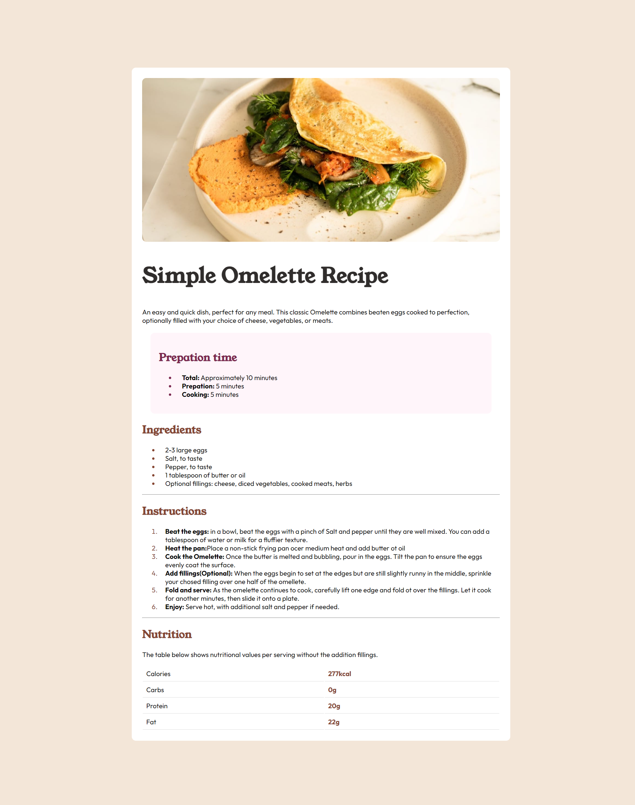
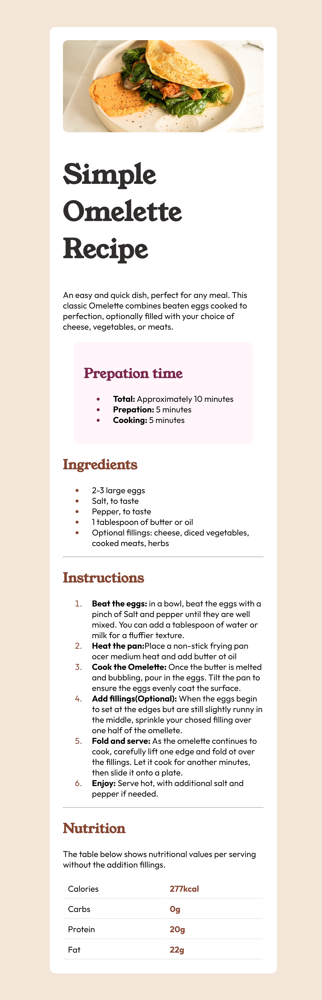

# Frontend Mentor - Recipe page solution

This is a solution to the [Recipe page challenge on Frontend Mentor](https://www.frontendmentor.io/challenges/recipe-page-KiTsR8QQKm). Frontend Mentor challenges help you improve your coding skills by building realistic projects. 

## Table of contents

- [Overview](#overview)
  - [The challenge](#the-challenge)
  - [Screenshot](#screenshot)
- [My process](#my-process)
  - [Built with](#built-with)
  - [What I learned](#what-i-learned)
  - [Continued development](#continued-development)
  - [Useful resources](#useful-resources)
- [Acknowledgments](#acknowledgments)

**Note: Delete this note and update the table of contents based on what sections you keep.**

## Overview
The challenge was to build a recipe page and make it look as close to the designs provided as possible. The designs were for both desktop 
and mobile .

### Screenshot

And here is my solution for the desktop  and mobile 

## My process

### Built with

- HTML
- CSS custom properties

### What I learned

I had a lot of things to learn in this project. For example, the use of section tag, span tag, creating styles within heading tags, making use of classes which I later used in CSS to deccorate specific html elements.

### Continued development

I want to learn more about the proper use of html elements and tags. The way I used them, it reached a time and they became so overwhelming, especially when it came to the part of styling either from the external CSS file or within the html itself. Its a mess, but gives me hope that I can do better.

### Useful resources

- [Example resource 1](https://w3schools.com) - I used it for the majority of the work such as how classes are created and how to use the style element within tags.
- [Example resource 2](https://https://paletadecolores.online/en/html-colors/brown/wenge/) - I stambled on this website trying to figure out how the wenge brown color looks like and instead i ended up using it as an example to learn how they created the white background. I accessed the html and css code they used using the devtools.

## Acknowledgments

I took on this challenge after two weeks of trying to learn html and css on a daily basis. I needed something that would make me feel like the hours am putting in to learn aint in vain. Therefore, I am acknowledging MYSELF and the effort and resilience I am putting in to learn and be a good front-end web developer. I also acknowledge  for creating this platform to help us, aspiring developers, to grow the confidence coding.
